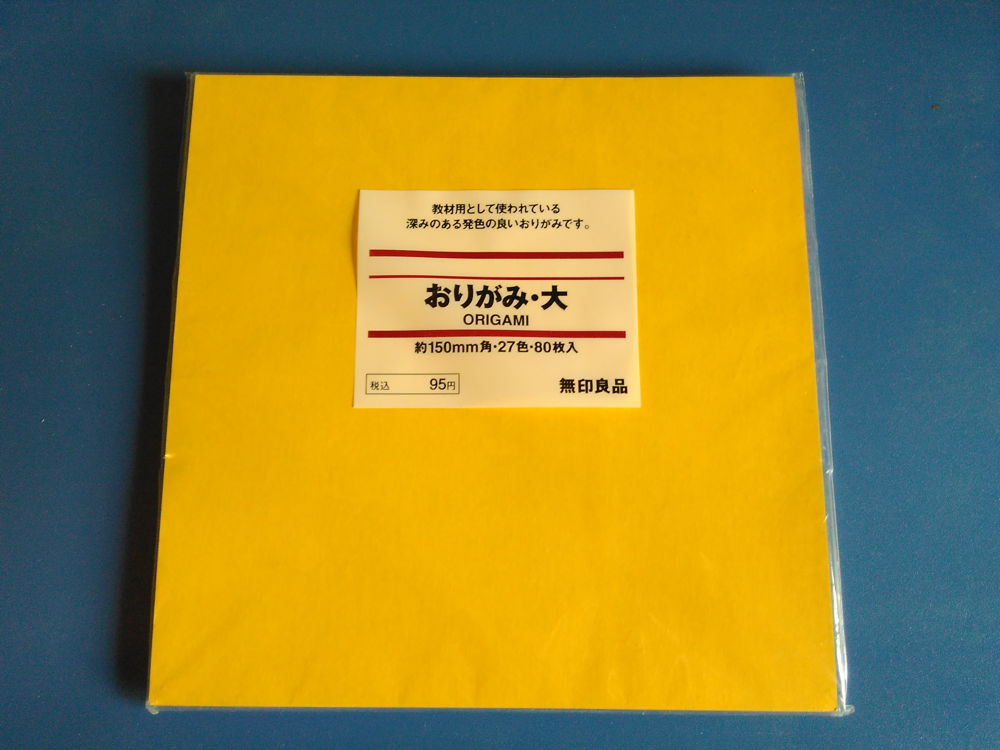
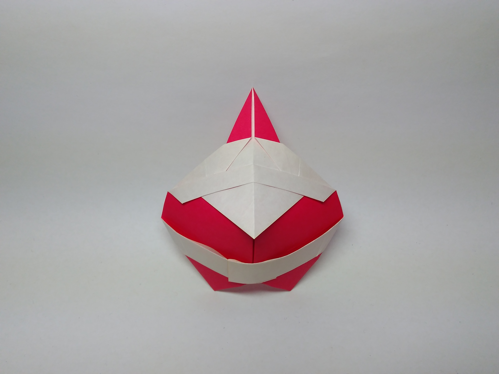
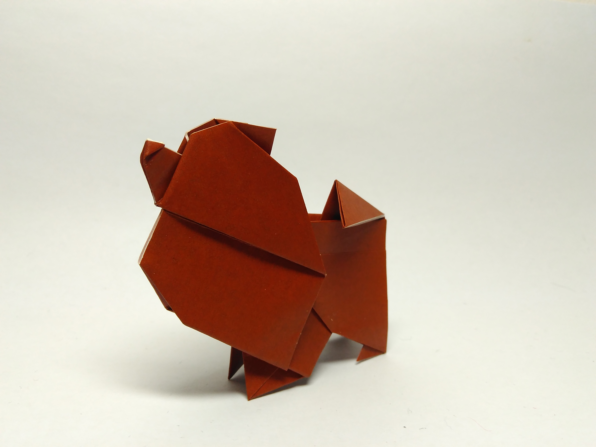
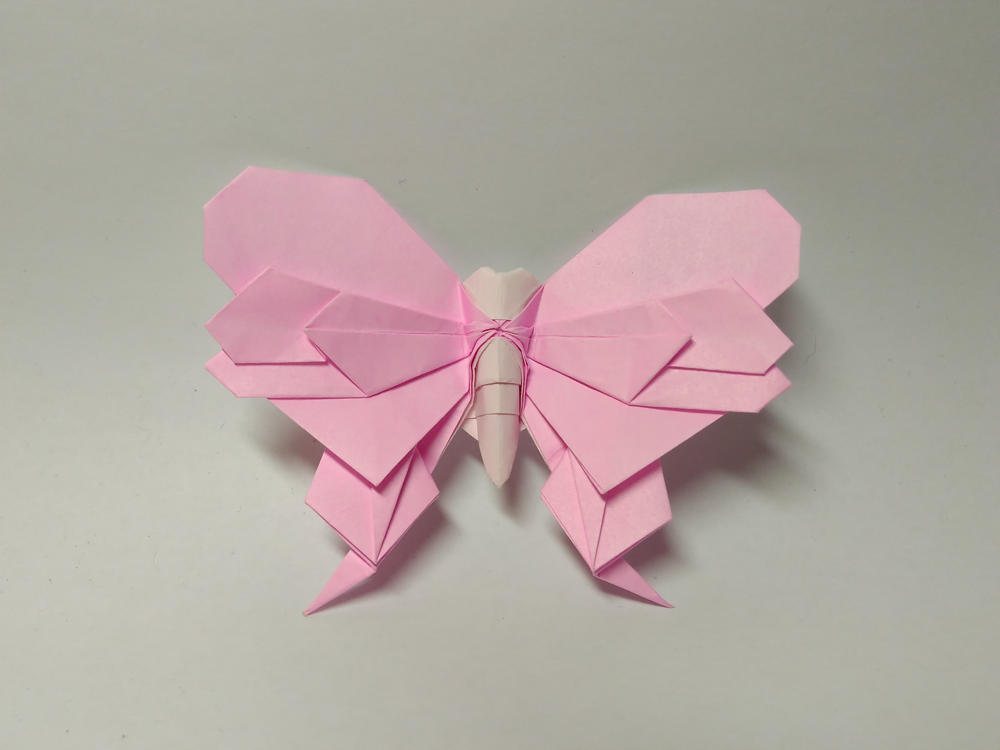
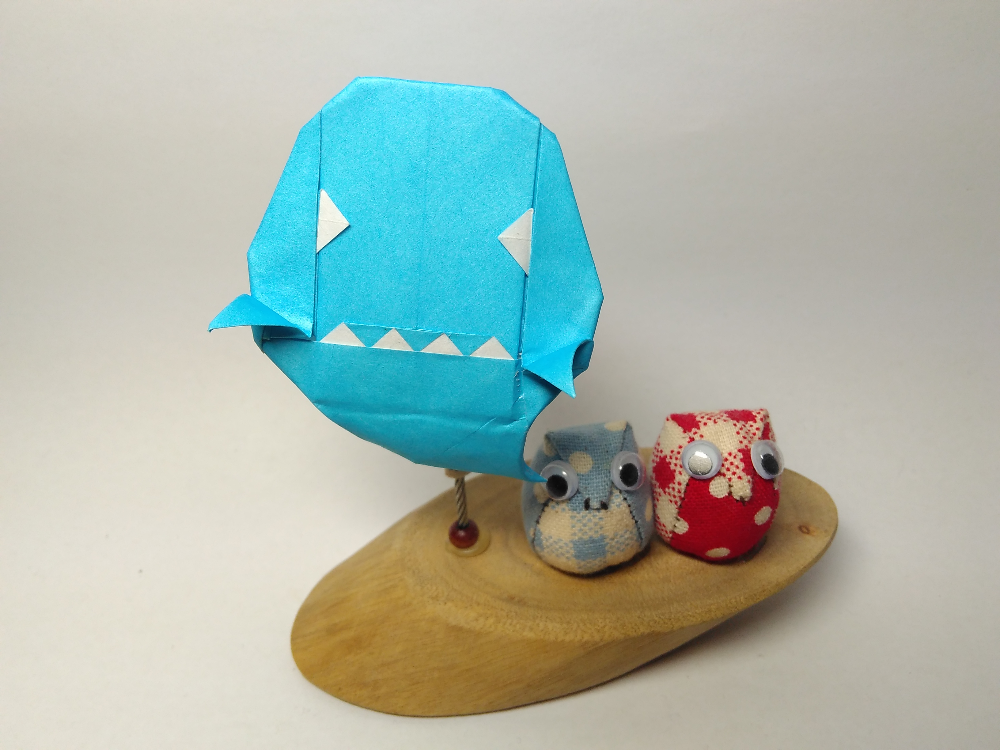
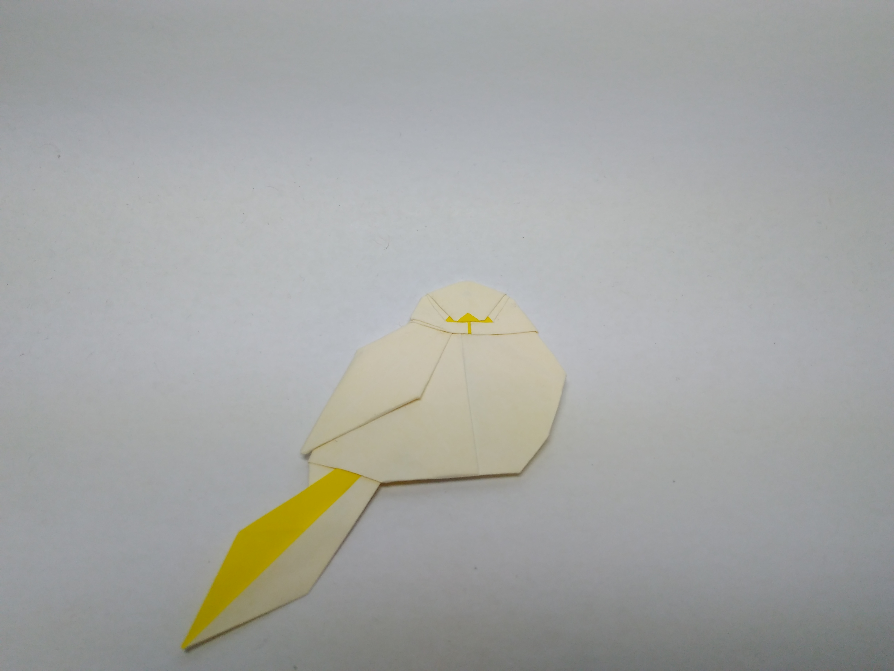
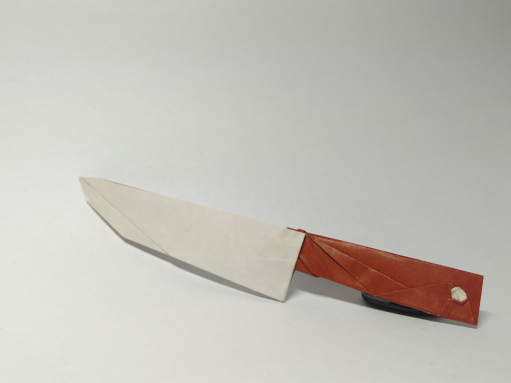
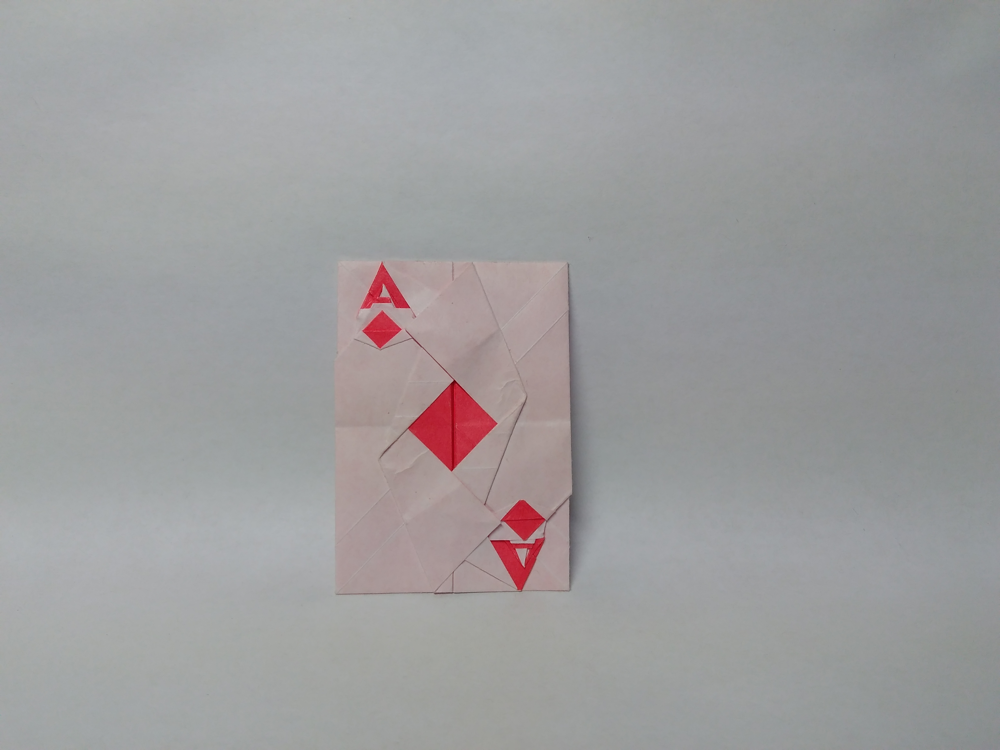

**MUJI使用指南**
======

## **序言Prologue**

### 关于MUJI

>1980年无印良品诞生于日本，主推服装、生活杂货、食品等各类优质商品。
无印良品是指“没有名字的优良商品”
——无印良品官网

要说来，纸与折纸的特点与无印良品的理念异曲同工。

>"可以用 '空容器 '做比喻。正是因为它简单而空白，所以才会诞生接纳所有人思想的高度灵活性。"
——无印良品官网

折纸艺术家在纸张上还原整个世界甚至创造想象中的世界，即体现着纸作为“容器”接纳人思想的特点。

### 关于MUJI纸

折友们所谓MUJI纸，即无印良品公司的双色纸。（当然，广义上的MUJI可以指代一切双色纸，但这里主要讨论狭义的，即无印良品的双色纸）

MUJI纸为边长15cm的正方形纸，一面彩色一面白色，大约60g/m²。整包的MUJI纸可在MUJI旗舰店内购买，内地每包9元，含27色的双色纸共80张（具体颜色分配未统计，有一两张全白的纸）。MUJI纸质量上乘，每张的误差基本都在0.5mm以内。值得一提的是，MUJI纸为再生纸，相对环保。

对我来说，MUJI纸是我入坑时入手的第一种专门用来折纸的纸，入坑时买的五包，一直用到了现在，还未用完。对于现在的许多折友，MUJI或许仍是入坑时的不二选择。

## **MUJI使用概述Brief Guidance**

本部分主要是宽泛的讲一讲本人使用MUJI的经验，提供一个大体的框架。具体的作品推荐请看下一个大标题。

### MUJI的手感

就本人的经验来看，MUJI纸要比大多数折纸专门用纸更硬、更厚，不过比大多数生活中随手一抓一把的纸要“柔”许多，因此折叠时卷起纸层时不会在纸上留下不必要的痕迹，可以很柔和、很干净地翻双色、闭沉折、做曲线折痕。

就用MUJI折制而言，谷折如果不使劲压的话折痕不会很明显，而峰折只要折出来就是很清晰、很细的折痕。这点在无痕时要注意。

MUJI折痕很容易翻转，翻转个5次左右是不会掉色的。

MUJI纸如果压折痕压的太狠了有可能会掉色，不过不至于在折痕处断裂，纸张韧性良好。

### MUJI使用注意事项

MUJI虽然是好纸，但限于大小的缘故，不宜折制细节多的作品。并非折不了，而是过小的细节在折痕处容易掉色。

不建议使用MUJI纸折湿折作品，一来纸张不够厚实，湿折容易皱，二来颜色面会透色到白色面，使效果不尽如人意。

上胶方面，如果是502的话，会让纸张表面变成灰黑色，如果弄脏了会很难看，因此还是用白胶比较好。涂白胶的时候也不能太多，我一般是用牙签往缝隙里涂抹。如果太多的话，水分多了容易透色。

至于多折痕交汇处容易烂这件事，无论是什么纸都是一样的，有时需要涂胶加固。

### MUJI的优势

由于是用来折小物，一般不会消耗太多的时间，安排在闲暇时是一种小确幸，一种清福。

MUJI纸大小适于折大多数的中等难度作品，适用作品范围较广。

15cm的纸，包装简便，易于携带，塞在兜里，可随时随地折。

在潮湿的天气一般不会变形，造成的误差最多也不过是0.5mm上下。

颜色丰富，一包折下来的作品摆在桌面上，色彩多样怡人，给人以清新愉悦之感，不显单调枯燥。

### MUJI适用的作品

如果用一个词来概括MUJI适合折的作品，那就是“小物”。

若要展开来说，可以分为作品类型，作品难度等。

由于是双色纸，适用的作品当然就是双色作品了。至于具体的颜色的斟酌损益，那就是各位折友见仁见智的事情了。如果需要双彩色，上色也并非难事，MUJI的涂色基本不会透色，只需注意涂上的颜色会不会掉即可。

特别地，类似于马伯纳的犀牛和萩原元的松鼠这样的伪·单色作品虽然用双色纸会出现双色，但却并非该作品设计的初衷，因此不适合用MUJI来折。而真·单色作品虽然用MUJI或许可以折，但折来些许可惜。

从难度角度考虑，MUJI一般适用于约100步或步骤更少的作品（个人感觉）。

如果折图上附有比例，可以估算一下最小细节大概的大小，如果在1mm(即纸张边长的1/150)以上就会比较容易操作。

有些作品会写推荐用纸（一般就是原作所用的纸的大小），使用那里指出的用纸大小应该折制该作品最顺畅，但并不是极限。因此，根据个人经验，推荐用纸25cm以下的作品用MUJI都应该能应付得来。当然，根据设计者的不同，推荐用纸有时可能会很大，这时就需要仔细过一遍折图，感受一下作品的难度再决定是否使用MUJI。

若是作品太简单或比例过大，可以将一张15cm×15cm的纸裁成四张7.5cm×7.5cm的小纸，增强对纸张的利用效率。

## **MUJI作品指南 Model Recommendations**

此部分是本篇文章的重点，也是最实用的的一部分吧。

这里我思考良久要不要分一个难度等级，最终决定设定一个粗略的框架。我仅尽绵薄之力将作品由易到难排列，不一定完全准确，同一难度内难度相差均不大，没有过细排列。毕竟，据不完全统计，我已经用MUJI折了200余件作品，不同时期对作品有不同的看法，排个序着实费心费力。

### 零难度作品

### 简单作品

### 中等难度作品

### 中上难度作品

当然也有许多高难度作品可以使用MUJI来折，不过那就是鬼畜了，在这里不做推荐。

## **后记Epilogue**

MUJI纸折制的作品体现的是一种简洁之美。简单的线条，简单的几何图形，在形象化的展现作品原型的样貌同时，给人以一种艺术的美感。

>设计师知道自己要达到完美，不在于无物可增，而在于无物可减。
——圣 -埃克苏佩里

折MUJI纸的体验，不如蜡纸那般轻薄，不如卡纸那般厚重，看似是无味的，但却能从简单的操作中表达人类思维对万物的转化，更重要地，体现出折制者的智慧与哲思。MUJI不仅限于新手的锻炼，更在于折过复杂作品后的返璞归真。

>道常无为，而无不为。
——《道德经》
